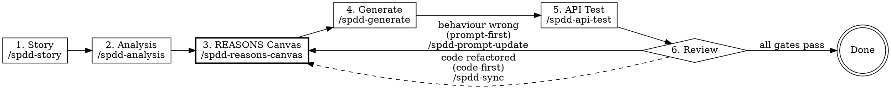
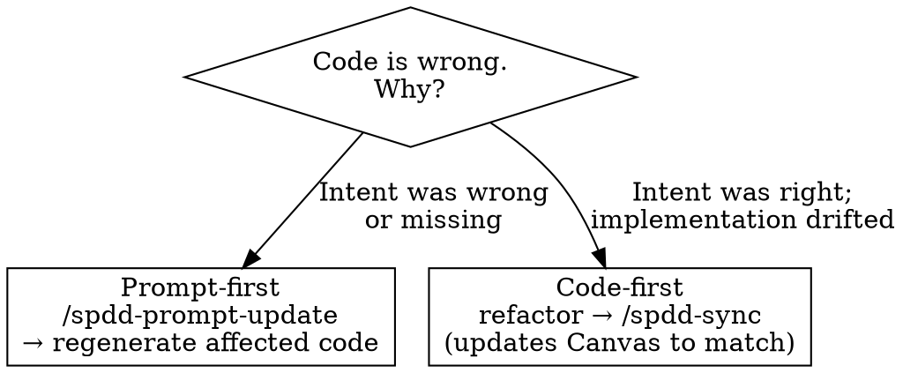

# Structured-Prompt-Driven Development (SPDD)

## Overview

SPDD treats **the prompt as the delivery artefact** and code as its mechanically-derived output. The central artefact is the **REASONS Canvas** (Requirements, Entities, Approach, Structure, Operations, Norms, Safeguards). Code, tests, and review feedback all flow back into the Canvas before they flow into the codebase.

**The Golden Rule:** *When reality diverges, fix the prompt first — then update the code.*

Source: [martinfowler.com/articles/structured-prompt-driven](https://martinfowler.com/articles/structured-prompt-driven/).

## When to use

Use when **all** are true:
- Behaviour is changing (not a typo, not a rename, not formatting).
- More than one acceptance scenario is plausible (boundary, error, normal).
- The change will be reviewed by someone other than the author.

Skip when:
- Single-file, single-purpose patch with obvious correctness.
- Exploratory spike that will be thrown away.
- Pure refactor (no observable behaviour change) → use `/spdd-sync` only, see [references/sync-decision-tree.md](references/sync-decision-tree.md).

## The closed loop



The two feedback edges are the heart of SPDD. See [references/sync-decision-tree.md](references/sync-decision-tree.md) for which edge to take.

## Stage checklist

For every non-trivial change, work through these stages **in order**. Each stage produces a named, reviewable artefact. Do not skip ahead — skipping earns rework, not speed.

| # | Stage | Input | Artefact produced | Template | Gate to pass |
|---|---|---|---|---|---|
| 1 | Story | Raw idea | INVEST stories with Given/When/Then | [references/story-template.md](references/story-template.md) | Each story ≤ 5 days, each AC has numeric example |
| 2 | Analysis | Story | Domain concepts / strategy / risks / AC coverage | [references/analysis-template.md](references/analysis-template.md) | Every AC mapped to an approach element; risks named |
| 3 | Canvas | Analysis | REASONS Canvas (7 sections) | [references/reasons-canvas-template.md](references/reasons-canvas-template.md) | All 7 sections present; Operations have method signatures |
| 4 | Generate | Canvas | Source code | (canvas drives the prompt) | Code references Canvas sections; no scope creep |
| 5 | API test | Canvas | cURL scenarios: normal / boundary / error | [references/api-test-template.md](references/api-test-template.md) | Every Operation has at least one normal + one error case |
| 6 | Review | Code + tests | Pass or one of two loops | [references/sync-decision-tree.md](references/sync-decision-tree.md) | Either all gates green, or correct loop chosen |
| 7 | Unit tests | Code + Canvas | Test code from scenarios | [references/unit-test-template.md](references/unit-test-template.md) | No duplicate scenarios; every Safeguard has a negative test |

**Create the TodoWrite items immediately**, before you write the first reply to the user — one per stage in the table above. Do not defer them until "after they approve scope": the todos are what makes the negotiation visible.

**Initial direction is always prompt-first.** A new feature has no code to refactor; you are producing the prompt, then deriving the code. The prompt-first vs code-first choice only arises *after* the first `/spdd-generate`, when reviewers ask for changes.

**Stage 0 — Clarify (when needed).** If the raw idea has un-resolvable ambiguities (e.g. "what does quota reset mean at month boundaries?"), put them in section 5 of the Analysis template *and ask the human before* writing Story ACs with numbers. Do not invent numerics to keep moving.

## REASONS Canvas (the central artefact)

```
R — Requirements   What problem; testable definition of done.
E — Entities        Domain types, relationships, invariants.
A — Approach        Strategy: design pattern, algorithm choice.
S — Structure       Where the change fits; modules, deps, boundaries.
O — Operations      Concrete method signatures + step-by-step behaviour.
N — Norms           Cross-cutting standards (logging, error type, naming).
S — Safeguards      Non-negotiable invariants (security, performance, $).
```

The **Abstract** part is R/E/A/S, the **Specific** part is O, the **Common Standards** part is N/S. Full template at [references/reasons-canvas-template.md](references/reasons-canvas-template.md).

## Which loop after review? — decision rule



Only **prompt-first** changes behaviour. **Code-first** must leave behaviour identical — re-run API tests after to prove it. Full rules at [references/sync-decision-tree.md](references/sync-decision-tree.md).

## Anti-patterns

| Don't | Why | Do instead |
|---|---|---|
| Skip Analysis and go straight to Canvas | Drift between business intent and design | Run `/spdd-analysis` even on small features; the document is short |
| Treat the Canvas as a one-shot doc | Canvas rots → next iteration starts from cold | Update Canvas in place via `/spdd-prompt-update` or `/spdd-sync`; commit alongside code |
| Regenerate the whole codebase on a small change | Loses git history and review locality | Targeted diffs only — Canvas update + `/spdd-generate` regenerates only affected files |
| Use code-first when behaviour changed | Canvas now lies; future reviewers misled | Prompt-first whenever observable behaviour shifts |
| Use prompt-first for a pure rename | Pollutes Canvas with implementation noise | Refactor → `/spdd-sync` |
| Stop at "tests pass" without re-running API tests after sync | Refactor regression | Always re-run the API-test script generated by `/spdd-api-test` (e.g. `scripts/spdd/test-<canvasId>.sh` — see [references/api-test-template.md](references/api-test-template.md)) after a code-first loop |
| Inline norms/safeguards into a single Canvas | They don't accumulate across features | Reference shared NormProfile / SafeguardProfile from the Canvas |

## Quality gates (condensed)

Eight gates from the article, with concrete pass/fail criteria, in [references/quality-gates-checklist.md](references/quality-gates-checklist.md). Minimum: every Canvas section reviewed, API tests green, one human approval at Review.

## Tooling hooks

- **On llm4zio** (i.e. when CWD is the `llm4zio` repo or a project whose `CLAUDE.md` references the canvas-domain): the gateway's `spdd_*` MCP tools are **mandatory** — they persist artefacts via event sourcing and run governance gates automatically. Read [references/llm4zio-overlay.md](references/llm4zio-overlay.md) before Stage 1.
- **Anywhere else**: produce the artefacts as plain markdown files under `spdd/` and `requirements/`, naming them `[ID]-[YYYYMMDDHHMM]-[Type]-Title.md` (e.g. `BILL-001-202604291100-[Analysis]-multi-plan-billing.md`).

## Red flags — STOP

- "I'll just write the code, the spec is in my head" → no, run `/spdd-analysis`.
- "We can write the Canvas after the code is done" → no, then it is documentation, not a prompt.
- "The Canvas is too big to maintain" → it is too big because it is doing the wrong job; split the story. **Heuristic:** one Canvas per *deployable increment* (one PR's worth of behaviour change); if Operations exceeds ~10 method-level steps or Entities exceeds ~5 first-class types, split.
- "Tests are passing, ship it" without re-running API tests after a sync → not done.
- "I'll regenerate everything" → almost always wrong; use targeted diffs.

## Reference index

- [references/reasons-canvas-template.md](references/reasons-canvas-template.md) — the Canvas, fillable.
- [references/story-template.md](references/story-template.md) — INVEST + Given/When/Then.
- [references/analysis-template.md](references/analysis-template.md) — analysis-context structure.
- [references/api-test-template.md](references/api-test-template.md) — cURL scenario format.
- [references/unit-test-template.md](references/unit-test-template.md) — test scenarios → test code.
- [references/sync-decision-tree.md](references/sync-decision-tree.md) — prompt-first vs code-first.
- [references/quality-gates-checklist.md](references/quality-gates-checklist.md) — 8 gates with criteria.
- [references/llm4zio-overlay.md](references/llm4zio-overlay.md) — MCP tools and BCE mapping for the llm4zio platform.
