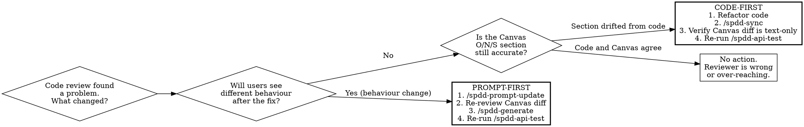

# Sync Decision Tree — Prompt-First vs. Code-First

The single most-violated rule in SPDD is *which loop to take when code and prompt diverge*. This document gives the decision rule and the failure modes.

## The Golden Rule

> **When reality diverges, fix the prompt first — then update the code.**

This is the **only** rule you need when behaviour is changing. The exception is when behaviour is **not** changing (refactor): then code-first.

## Decision flow

## Worked diagnoses

### "The bug fix changes how we round overage charges"
- **Behaviour change?** Yes — billed amount differs.
- **Loop:** prompt-first.
- **Action:** open the Canvas, edit S — Safeguards (rounding rule), re-run `/spdd-generate` for `op-001`, re-run API tests, especially the boundary cases.

### "We renamed `BillingCalculator.calculate` to `compute` for consistency"
- **Behaviour change?** No, identical results.
- **Section drifted?** Yes — Canvas O still says `calculate`.
- **Loop:** code-first.
- **Action:** finish the rename in code, then `/spdd-sync` updates O signatures. Diff the Canvas: only method names changed. Re-run API tests to prove no behaviour drift.

### "We extracted a private helper to remove duplication"
- **Behaviour change?** No.
- **Section drifted?** Probably not — the public Operation is the same.
- **Loop:** code-first if Structure changed, otherwise no Canvas update needed.

### "Reviewer says the algorithm should use a Map lookup for performance"
- **Behaviour change?** No, same outputs; only constant-factor faster.
- **Section drifted?** Yes — Approach now talks about a different data structure; Norms may have a perf clause.
- **Loop:** code-first. Refactor, then `/spdd-sync` updates Approach + Norms.
- **But:** if the Canvas had a Safeguard pinning the previous algorithm (rare; usually for compliance), this is a Canvas change first.

### "Product changed their mind: Pro plan is now 750K not 500K"
- **Behaviour change?** Yes.
- **Loop:** prompt-first. The Story changes too — re-run from `/spdd-story` if the change is large; otherwise edit the Story AC numerics, then `/spdd-prompt-update` propagates to R/E/O.

## Failure modes (anti-patterns)

| Wrong move | Symptom | Fix |
|---|---|---|
| Code-first when behaviour changed | Canvas now lies. Future readers think the new code is the original intent. Audit trail broken. | Revert the code-first commit; redo as prompt-first. |
| Prompt-first for a pure rename | Canvas churns with implementation noise; reviews get noisier. Operations diff is huge for no reason. | Revert; redo as code-first. |
| Skipping the post-sync API test re-run | Subtle behaviour drift slips through "harmless refactor". | Always re-run `scripts/spdd/test-*.sh` after `/spdd-sync`. Block merge until green. |
| Updating Canvas + code in the same commit, both editorial | Reviewer can't tell which led which. | One commit per loop: a "prompt update" commit, then a "regenerate code" commit. |
| `/spdd-sync` with a partially-refactored codebase | Canvas captures an inconsistent snapshot. | Refactor must compile and pass tests **before** you sync. |
| Editing the Canvas by hand without `/spdd-prompt-update` | No event-sourced trace; status doesn't move; downstream `Stale` flag missed. | Always use the tool; if you must edit by hand, manually flag downstream code as `Stale`. |

## Quick test: which loop?

Ask yourself out loud:

> "If I run `git diff` *before* and *after* my fix, will the API tests behave differently against either snapshot?"

- **Yes** → behaviour changed → **prompt-first**.
- **No** → behaviour identical → **code-first**.

If you can't tell, you do not understand the change well enough to do it. Stop and analyse.
