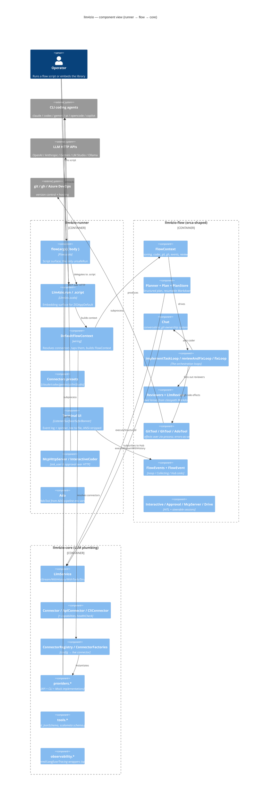

# llm4zio — Architecture Guide for New Contributors

## 1. What this repository is

**llm4zio** is a **ZIO-native Scala 3 library for talking to LLMs and orchestrating agentic software-development flows.** You write an ordinary `ZIO[R, E, A]` program that plans work, hands code-editing to an AI agent, has *other* agents review the resulting diff, then commits / pushes / opens a PR — all expressed in code rather than coaxed out of a chatbot.

It is explicitly the **ZIO counterpart to VirtusLab's [orca](https://github.com/VirtusLab/orca)** (Ox/direct-style): the same values — thin, readable, errors-as-data, no ceremony — re-expressed in the ZIO effect system. The flow layer is a clean-room reimplementation inspired by orca (orca is Apache-2.0, llm4zio is MIT — see `LICENSE`, `README.md`); a few pieces are noted as direct ports of orca heuristics (e.g. `flow/ToolInputSummary.scala`). The philosophy, from `README.md` and `CLAUDE.md`: *if you want AI-generated code to always be reviewed by another agent, don't coerce the agents — express that requirement in code; don't spend tokens on formatting/committing/opening PRs, an ordinary ZIO program does that.*

> **History.** Per `CLAUDE.md`, llm4zio was once a ~39-module "agentic software house" product, forked down in 2026 to this focused 3-module library. The full product lives on the `archive/product-2026-06` branch; the current tree is the library only.

Two ways to consume it:
- **As an embedded library** — `Llm4zio.run` inside a `ZIOAppDefault` (`modules/llm4zio-runner/src/main/scala/llm4zio/runner/Llm4zio.scala:43`).
- **As single-file flow scripts** — `examples/*.sc`, each run with one `scala-cli run` command; artifacts are fetched on first run.

---

## 2. The 30-second mental model

A flow is an ordinary ZIO program handed a **`FlowContext`** (`modules/llm4zio-flow/src/main/scala/llm4zio/flow/FlowContext.scala:14`). It asks the **reasoning** connector to produce a structured `Plan` (persisted as resumable Markdown), checks out a branch via `GitTool`, then loops over tasks: the **coder** CLI agent edits the working tree through a `Chat`, the **reviewers** judge the resulting `git.diff` and feed findings back to the coder until clean, and the runtime commits/pushes/opens the PR. Every step emits `FlowEvent`s the runner renders to the terminal (with control sequences stripped for safety) and tees to a log. Providers are uniform behind one trait `LlmService`; recoverable situations are typed *values*, genuine failures are typed *errors*; nothing touches a database — the agent CLIs and `git`/`gh` manage their own auth.

The two roles to keep straight (the "role split"):

| Role | Field in `FlowContext` | Typically | Does |
|---|---|---|---|
| **reasoning** | `reasoning: LlmService` | an **API** connector (or a CLI one) | planning, review judgements, structured output |
| **coder** | `coder: LlmService` | a **CLI** coding agent (claude/codex/gemini/pi) | edits the working tree via its own tool loop |

A single all-CLI backend (e.g. all-claude) can fill both seats.

---

## 3. Module layout & dependency direction

Three published modules under `modules/`, aggregated by a non-published root (`build.sbt`):

```
llm4zio-runner  →  llm4zio-flow  →  llm4zio-core
```

Arrows never reverse (`build.sbt`: `llm4zioFlow.dependsOn(llm4zioCore)`, `llm4zioRunner.dependsOn(llm4zioFlow, llm4zioCore)`). All three publish to Maven Central under `io.github.riccardomerolla`; the root is `publish / skip := true`. Source layout per module is `src/main/scala`, `src/test/scala`, and (flow + runner) `src/it/scala` for integration tests.



---

## 4. `llm4zio-core` — the provider-agnostic LLM layer

*Packages: `llm4zio.core` (15 files), `llm4zio.providers` (~22 files), `llm4zio.tools`, `llm4zio.observability`.*

### One trait to depend on: `LlmService`
Everything talks through `LlmService` (`modules/llm4zio-core/src/main/scala/llm4zio/core/LlmService.scala:17`). Its surface:

- `executeStream(prompt)` / `executeStreamWithHistory(messages)` → `Stream[LlmError, LlmChunk]` (streaming, `LlmService.scala:19,22`)
- `executeWithTools(prompt, tools)` → `IO[LlmError, ToolCallResponse]` (tool calling, `LlmService.scala:25`)
- `executeStructured[A: JsonCodec](prompt, schema)` → `IO[LlmError, A]` (typed output, `LlmService.scala:28`), plus `executeStructuredWithUsage` → the value plus **optional** token usage and **optional** model name, for cost tracking (`LlmService.scala:34`; the default delegates with `None`s)
- `isAvailable` → `UIO[Boolean]` (health check, `LlmService.scala:41`)

Callers depend on this capability, never on a concrete backend. The companion (`LlmService.scala:43`) mirrors each method as a `ZIO[LlmService, …]` accessor, and `fromConfig` builds the right provider from an `LlmConfig` by matching on `LlmProvider`.

### `Connector` and the API/CLI split
`Connector extends LlmService` (`Connector.scala:13`), adding `id`, `kind`, `healthCheck` (→ `HealthStatus`), and `capabilities`. Two sub-traits:

- **`ApiConnector`** — `kind = Api` (`Connector.scala:25`).
- **`CliConnector`** — `kind = Cli` (`Connector.scala:34`). It only requires two primitives, `complete` and `completeStream`, plus argv builders; the richer `LlmService` methods are **derived by default**. Notably `executeStructured` is implemented for *every* CLI provider by injecting a schema hint into `complete` and parsing the text back (`Connector.scala:62`, via `core/StructuredOutputs.scala`). `executeWithTools` defaults to failing with `InvalidRequestError` unless a connector overrides it (`Connector.scala:57`). `CliConnector` also declares `interactionSupport: InteractionSupport`, the enum the default `capabilities` branches on.

### Capabilities are not uniform — declared per connector
`ConnectorCapabilities` (`Connector.scala:103`) records what a connector can actually do (`streaming`, `resumableSessions`, `interactiveSessions`, `askUser`, `approval`, `structuredOutput`, `usageReporting`), so a flow can refuse an unsupported workflow up front. Encoded asymmetry: claude exposes interactive/ask-user/approval; **gemini declares `InteractiveStdin` yet keeps `askUser = false`** because it can't expose an ask-user tool headless; opencode/copilot are continuation-only; pi runs headless "YOLO" (`Connector.scala`, `README.md`).

A read-only nuance worth knowing: when `readOnly` is set, `ClaudeCliConnector` uses **default** permission mode plus `disallowed-tools=Write,Edit,NotebookEdit` so the reasoning seat answers directly — plan mode would instead make claude *propose a plan*, breaking `executeStructured` (`providers/ClaudeCliConnector.scala`, fix in commit `0b34a15f`).

### Models, config, registry
- **`Models.scala`** — `LlmProvider` enum, `ConnectorId`, `Message`/`MessageRole`, `TokenUsage`, `LlmChunk`, `LlmConfig`, plus `LlmResponse(content, usage, metadata)` and `StreamProgress`.
- **`ConnectorConfig.scala`** — user-facing config ADT with three cases: `ApiConnectorConfig`, `CliConnectorConfig` (carries `flags`, `sandbox`, `workingDir`, `readOnly`, `turnLimit`, `envVars`), and `FallbackChain(connectors: List[ConnectorConfig])` (a chain tried in order).
- **`Conversation.scala` / `ContextManagement.scala`** — conversation/history value types and context-window management for the structured/streaming paths; `SchemaDerivation.scala` derives JSON schema for `executeStructured`.
- **Held interactive sessions** — `AgentSession.scala` (the abstraction) and `providers/ClaudeAgentSession.scala` (concrete bidirectional claude session): the pointer for adding a new interactive connector.
- **`ConnectorRegistry` + `ConnectorRegistryLive`** resolve a config to a live connector; **`ConnectorFactories.createRegistry(http, cli)`** (`providers/ConnectorFactories.scala:9`) wires the concrete provider map and exposes a `live` ZLayer.

### Providers (`llm4zio.providers`, ~22 files)
- **API-shaped:** `OpenAIProvider`, `AnthropicProvider`, `GeminiApiProvider`, `LmStudioProvider`, `OllamaProvider`, `OpenCodeProvider` — streaming, structured output, usage reporting.
- **CLI-shaped:** `ClaudeCliConnector`, `CodexConnector`, `GeminiCliProvider`, `PiConnector`, `OpenCodeCliConnector`, `CopilotConnector`.
- **Test:** `MockProvider` — deterministic.
- **Shared infra:** `HttpClient.scala` (incl. a `reliableClient` with idle-timeout disabled so a slow local model's per-request `timeout` is the only bound — `CHANGELOG.md` 3.4.1; plus a generic `send(method, url, body, headers, contentType)` for the ADO REST client), `CliProcessExecutor` / `LiveCliProcessExecutor`, `CliStreamJson` (parses claude/codex/gemini stream-JSON; fixtures under `src/test/resources/*-stream.jsonl`), `RateLimiter`, `RetryPolicy`, `UsageLimits`, and per-provider model catalogues (`AnthropicModels`, `OpenAIModels`, `GeminiModels`, `LmStudioModels`).

### Tools (`llm4zio.tools`)
`Tool.scala`, `ToolRegistry`, `BuiltInTools` (+ `core/SchemaDerivation.scala`). The notable piece: `ToolSchemaGenerator.fromMethodSignature` uses **scalameta** to turn a Scala method signature string into a JSON Schema (Scala types → JSON types; `Option`/defaults → not-required).

### Observability (`llm4zio.observability`) — present but opt-in
`MeteredLlmService` wraps any `LlmService` to record counts/tokens/latency into `LlmMetrics`; `Langfuse`, `Tracing`, `LlmLogger`, `Metrics`, `Logging` are similar decorators. **These are not wired by the runner by default** — the runner uses flow-layer `EventTappingService`/`CostTracker` instead (see §6).

---

## 5. `llm4zio-flow` — the orca-shaped agentic layer

*Package: `llm4zio.flow` (35 source files).* This is where the "flow" concepts live.

### `FlowContext` — everything a flow needs
`FlowContext` (`FlowContext.scala:14`) bundles `reasoning`, `coder` (both `LlmService`), `git: GitTool`, `gh: GhTool`, `events: FlowEvents`, optional `reviewers`, `coderCapabilities`, `userPrompt`, and `workDir`. It exposes `given FlowEvents = events` (`FlowContext.scala:31`) so `stage`/`fail` resolve their sink implicitly. Flow scripts receive it as a context function (`FlowContext ?=>`), which is how bare names (`git`, `coder`, …) resolve — via accessor extensions in `flow/ContextAccess.scala`.

### Plan / Task / PlanStore — resumable plain files
A `Plan(epicId, tasks, brief?)` (`Plan.scala:17`) persists as **plain Markdown** at `.llm4zio/plan-<hash>.md` — a deterministic path from the prompt (`Plan.defaultPath`, `Plan.scala:53`), so re-running the same prompt resumes the same plan. `PlanStore.parse`/`render` round-trip the file; `recoverOrCreate` resumes a crashed run. **No datastore.**

### Planner
`Planner.scala` produces structured types via `executeStructured`: `from` (`:30`), `reviewed` (self-critique, `:51`), `brief` (returns the codebase-brief *string*, `:67`), `briefed` (attach that brief to a `Plan`, `:78`), `assessThenPlan` (→ `Verdict[Plan]`, `:95`), `interactive` (asks clarifying questions first, `:116`), `triage` (→ `Triage`, `:149`). `defaultInstructions` push for **thin outcome slices** — "each a thin slice that delivers an observable outcome (split by outcome, not by technical layer), described in terms of behaviour, not mechanism" (commit `dad215d9`). `Triage.scala` also defines `IssueRef` (a parsed value type with `parse`); `Verdict.scala` is the shared assess-result type.

### Chat — stateful conversation with enforced git ownership
`Chat` (`Chat.scala`) is a conversation modelled as an accumulating `List[Message]` threaded through `executeStreamWithHistory` — there is no backend session token; continuity is replayed history. Crucially, **`Chat.start` prepends `CoderSystem.gitOwnership`** (`flow/CoderSystem.scala`) so the coder edits the working tree but does *not* commit/branch/push — keeping diff-based review meaningful. Opt out with `manageGit = true`.

### The loops (top-level functions)
- **`implementTaskLoop`** (`ImplementLoop.scala:13`) — runs each incomplete task inside a `stage`, persisting the plan after each (so a crash resumes). A live, steerable variant `implementTaskLoopLive` exists in `Drive.scala:76`.
- **`reviewAndFixLoop`** (`LlmReview.scala:151`) — the centrepiece. Each round: an optional `lint` gate runs first (if it fails, that's the result and LLM reviewers are skipped — fix the build first); otherwise a `ReviewerSelector` picks reviewers, their structured reviews fan out over the diff (`ZIO.foreachPar`, throttled by `parallelism` for rate-limited/local backends — e.g. `local.sc` uses `parallelism = 1`), findings merge, the coder fixes, and it re-reviews up to `maxRounds`. A `format` step — `Formatter.step(command, workDir)`, an `IO[FlowError, Unit]` defaulting to `ZIO.unit` — runs before each round.
- **`fixLoop`** (`ReviewLoop.scala:11`) — the generic evaluate→fix→re-evaluate primitive `reviewAndFixLoop` is shaped after. **File split:** `ReviewLoop.scala` holds *only* `fixLoop`; `ReviewerSelector` (`LlmReview.scala:26`), `Reviewers` (`LlmReview.scala:59`), and `reviewAndFixLoop` live in `LlmReview.scala`.

### Review system
`Review.scala` (`Severity`, `ReviewIssue`, `ReviewResult`), `Reviewer.scala` (a named lens = system prompt + optional changed-file regex scope, **loaded from classpath Markdown** via `Reviewer.fromResource`, under `src/main/resources/llm4zio/review/reviewers/*.md`), and `LlmReview.scala` (`Reviewers.all`/`.minimal` + opt-in lenses; selectors `ReviewerSelector.allEveryRound`/`whileDirty`/`llmDriven(picker)`). **Ten shipped lenses** (one MD each): `code-functionality`, `test`, `readability`, `code-structure`, `performance`, `security`, `scala-zio`, plus three opt-ins — `tdd-discipline`, `domain-language`, `effect-shape` (`Reviewers.tddDiscipline`/`domainLanguage`/`effectShape`, commits `d1c54ad5`, `7695a7a5`); append them to a roster, e.g. `Reviewers.minimal :+ Reviewers.tddDiscipline`.

### Side-effect tools over zio-process (`Proc.scala`)
- **`GitTool`** (`GitTool.scala:12`), bound to `workDir`. **Recoverable outcomes are values, not failures:** `createBranch → CreateBranch.AlreadyExists` (`GitTool.scala:94`), `commitAll → Commit.NothingToCommit` (`GitTool.scala:102`); these are enums returned in the value channel (`GitTool.scala:122`). Every git call carries a non-interactive env (`GIT_TERMINAL_PROMPT=0`, ssh `BatchMode=yes`) so a TTY-less flow fails fast instead of hanging on a credential prompt; GitHub pushes append a last-resort, github-scoped `GH_TOKEN`/`GITHUB_TOKEN` credential helper read at helper runtime (never in argv/logs), falling back to `gh auth git-credential` (`CHANGELOG.md` 3.3.0).
- **`GhTool`** (`GhTool.scala`) — PR create/update, issue read/comment, CI polling over the `gh` CLI. `readIssue` retries transient blips; `waitForBuild` polls `gh pr checks` to a terminal `BuildOutcome`; `updatePr` uses a REST `PATCH` via `gh api` to dodge the GitHub Projects-classic sunset that breaks `gh pr edit` (`CHANGELOG.md` 3.3.0).
- **`AdoTool`** (`AdoTool.scala`) — a REST client for Azure Boards work items (read/WIQL/comment/set fields-state-tags) + Azure Repos PRs and work-item↔PR linking (pure request-builders + parsers, thin effectful methods over `HttpClient`), driving a board-state-gated SDD flow. Added in v3.4.0.
- **`PrSummary`** (`PrSummary.scala`) — `summarisePr` produces a `PrSummary(title, body)` from a diff, used by the PR-creating examples.

### Events
`FlowEvent` is an enum of progress events — `StageStarted`/`StageCompleted`/`StageFailed`, `Aborted`, `Info`, `ToolUse`, `AssistantMessage`, `TokensUsed` (`FlowEvents.scala:9-17`). `FlowEvents` (`FlowEvents.scala:22`) is the sink trait with three implementations: `noop`, `Collecting` (tests, accumulates into a `Ref`), and `Hub` (a bounded broadcast with back-pressure). `stage(name)(effect)` and `fail(message)` (`Stage.scala`) publish events around an effect. `flow/ToolInputSummary.scala` compresses a tool call's raw JSON args into a compact `(…)` summary for the terminal tree (e.g. `{"file_path":"src/lib.rs"}` → `(src/lib.rs)`; ported from orca).

### Errors — the recoverable-vs-catastrophic split
`FlowError` ADT (`FlowError.scala`): `Persistence`, `PlanParse`, `Aborted`, `Process`, `Llm(message, cause: Option[LlmError] = None)`. The discipline (orca-flavoured): **expected, handleable outcomes go in the value channel** as typed results (`Commit.NothingToCommit`, `CreateBranch.AlreadyExists`); **genuine failures fail the effect** (`FlowError.Process`).

### Interactivity, safety & resilience
- `Interactive.scala` (`Interaction` abstraction), `Approval.scala` (`ApprovalPolicy`/`ApprovalDecision`), `McpServer.scala` (a transport-free MCP JSON-RPC handler exposing `ask_user` and `approve` tools to a CLI agent), `Drive.scala` (drives a held `AgentSession` turn, relaying events + bridging questions).
- `TransientRetry`; `UsageLimitAware` + `UsageLimitPolicy` (presets `off` (default) / `patient`; `heartbeat` pulses a "still waiting" `Info` every 5m during long sleeps) + `UsageLimitRetry.withUsageLimitRetry`; `CostTracker`/`PriceList` (token cost accounting); `EventTappingService` (taps an `LlmService` to emit `FlowEvent`s).

---

## 6. `llm4zio-runner` — entry points, wiring, terminal UI

*Package: `llm4zio.runner` (18 source files).*

### Two entry surfaces
- **`flow(args){ body }`** (`runner/Flow.scala:29`) — the **script surface** and the library's *only* `unsafeRun`. It resolves args/prompt, installs the Ctrl-C shutdown hook (interrupt the fiber → stages unwind → ✖ banner → JVM exits 130), and maps results to exit codes (2 = usage, 1 = failure). It simply delegates to `Llm4zio.script(...)` (`Flow.scala:40`).
- **`Llm4zio.run` / `Llm4zio.script`** (`runner/Llm4zio.scala:43` / `:136`) — the **embedding surface** for `ZIOAppDefault` apps: builds the `FlowContext`, streams progress to the terminal, provides the http/process layers, wraps the body in usage-limit retry, and renders a final ✖ banner on failure. `script` is the pure-ZIO core (testable up to the single unsafe run).

### Wiring: `DefaultFlowContext`
`DefaultFlowContext.build` (`runner/DefaultFlowContext.scala:55`) resolves connectors from the registry, roots the CLI coder in `workDir`, and **taps each connector** through `TransientRetry → EventTappingService → (optional) UsageLimitAware` (`DefaultFlowContext.scala:31-33`). `enrichApi` fills an API config's base URL + env API key (`ANTHROPIC_API_KEY` / `OPENAI_API_KEY` / `GEMINI_API_KEY`, `DefaultFlowContext.scala:83`). `make` (`:17`) bundles built connectors with `GitTool`/`GhTool` on `workDir` and a fresh event `Hub`.

### Presets and config
`Connectors.scala` ships ready-made presets so scripts reference `claude`/`codex`/`gemini`/`pi`/`grok`/`cursor`/`opencode`/`lmStudio` bare; `coderFromEnv()` reads `LLM4ZIO_CODER` (accepting `"codex"`/`"gemini"`/`"pi"`/`"agy"`/`"grok"`/`"cursor"`/`"opencode"`, defaulting to `claude`). Each preset carries its edit-enabling flag (e.g. claude `permission-mode=acceptEdits`; grok/cursor/opencode bake theirs into the connector — `--always-approve`/`--force`/`--auto`, swapped for their read-only mode when `readOnly`). Resilience env knobs: `RetryEnv` reads `LLM4ZIO_RETRIES` (default 3); `UsageWaitEnv` reads `LLM4ZIO_USAGE_WAIT` (`off`/`on`/`Nh`/`Nm`).

### Terminal rendering & MCP-over-HTTP
`TerminalListener`, `TerminalSurface`/`TerminalSafe`, `Palette`, `Banner`, `RunnerLog` — a top-down event log plus a pinned status line with a spinner, teed to a per-run log file; colour auto-disables off-TTY / under `NO_COLOR`. **`TerminalSafe` is security-relevant:** it strips ANSI CSI/OSC escapes and C0/C1 control bytes from all untrusted text (backend stderr, assistant messages, tool output) before styling. `McpHttpServer` binds `flow.McpServer` over zio-http and registers it with a claude agent; `InteractiveCoder` + `TerminalInteraction` route `ask_user`/approval back to the operator (powers `examples/implement-live.sc`); `LiveCliProcessExecutor` is the real subprocess executor at runtime. `ExampleFlow.scala` is the embedded `ZIOAppDefault` variant with an end-to-end integration test; `Ado.scala` (`Ado.withTool`/`Ado.configFrom`) builds an `AdoTool` from ADO pipeline env vars (`SYSTEM_*`, `LLM4ZIO_ADO_*` overrides) and provides a live HTTP client for the flow's duration — `FlowContext` is untouched.

---

## 7. A flow, top to bottom

The canonical shape (`examples/implement.sc`), all bare names resolving from the `FlowContext ?=>` context function:

```scala
flow(args, defaultPrompt = Some("Add a multiply function to the calculator crate")):
  val planPath = Plan.defaultPath(userPrompt)
  for
    plan      <- PlanStore.recoverOrCreate(planPath)(Planner.from(reasoning, userPrompt))
    _         <- stage("branch")(git.checkoutOrCreate(plan.epicId))
    coderChat <- Chat.start(coder, system = Some("You implement one task at a time in the current repo."))
    _         <- implementTaskLoop(planPath, plan) { task =>
                   coderChat.ask(task.description) *>
                     reviewAndFixLoop(Reviewers.minimal, reasoning, coderChat, task.title, git.diff) *>
                     git.commitAll(s"${plan.epicId}: ${task.title}").unit
                 }
  yield ()
```

### Effect shape of key operations
| Operation | Shape | Notes |
|---|---|---|
| `Plan.defaultPath`, `PlanStore.parse`/`render`, `Reviewers.merge`, `AdoTool` request-builders | **pure** | deterministic, no effect |
| `Planner.*`, `Chat.ask`, `LlmService.execute*`, reviewer calls | **bounded change** (network/LLM) | typed `IO[LlmError, …]`/`IO[FlowError, …]`; no preview |
| `GitTool.createBranch` / `commitAll`, `GhTool.createPr` | **bounded change, errors-as-values** | recoverable outcomes (`AlreadyExists`, `NothingToCommit`) returned in the *value* channel, not failures |
| `assessThenPlan → Verdict[Plan]`, `triage → Triage` | **preview-returns-a-plan** | the LLM returns a structured judgement/plan you inspect before acting |
| `reviewAndFixLoop` / `fixLoop` | **bounded change, iterative** | converge-or-give-up after `maxRounds`; returns the final (possibly still-dirty) `ReviewResult` |

---

## 8. External dependencies & quality attributes

| Concern | Choice | Evidence |
|---|---|---|
| Language / build | Scala **3.8.3**, sbt **2.0.0** (`project/build.properties`), JVM 21 | `build.sbt:1`, `.github/workflows/ci.yml` |
| Effect system | **ZIO 2.1.25** (`zio`, `zio-streams`) | `build.sbt:13` |
| Subprocesses | **zio-process 0.8.0** (via `flow.Proc`; never raw `ProcessBuilder`) | `build.sbt:14` |
| JSON | **zio-json 0.9.0** (`derives JsonCodec` everywhere) | `build.sbt:15` |
| HTTP | **zio-http 3.10.1** (API providers, MCP-over-HTTP, ADO REST) | `build.sbt:16` |
| Logging | **zio-logging 2.4.0** | `build.sbt:17` |
| Schema parsing | **scalameta 4.13.6** (tool-schema generation) | `build.sbt:18` |
| Terminal colour | **fansi 0.5.0** (runner only) | `build.sbt:29` |
| Testing | **zio-test** (+ `-sbt`, `-magnolia`), in `test` and `it` | `build.sbt:36-38` |
| Lint/format/publish | scalafix, scalafmt, sbt-tpolecat; sbt-ci-release + sbt-dynver | `project/plugins.sbt` |
| External processes at runtime | the agent CLIs (claude/codex/gemini/pi/…), `git`, `gh` — each manages its own auth | — |

The compiler is strict: `-Wunused:all`, `-Werror`, `-explain`, `-Xmax-inlines 128` (`build.sbt`). `build.sbt` excludes the Scala-2.13 `sourcecode` that scalameta drags in and silences the deprecated-`-Xfatal-warnings` warning so it doesn't itself fail under `-Werror`. **Gotcha:** a wildcard `import zio.*` pulls in `zio.Task`, which shadows the library's flow `Task` type — import specific names in files that name `Task`.

**What the design optimises for, and the trade-offs:**
- **Testability** — one `LlmService` seam + a deterministic `MockProvider`; effects are typed `IO[LlmError, …]`/`IO[FlowError, …]`, never `Throwable`; integration tests spawn real `git` against a local *bare* remote with **no network**.
- **Resilience** — typed errors with the recoverable-vs-catastrophic split, `TransientRetry`, usage-limit retry, non-interactive git env that fails fast rather than hanging, and resumable plain-Markdown plans (crash → resume, no datastore).
- **Extensibility** — new providers slot behind `Connector`/`ConnectorFactories`; new review lenses are just classpath Markdown; new flows are just `.sc` scripts.
- **Security/safety** — `TerminalSafe` strips control sequences from all untrusted text; secrets live only in env / the agent CLIs' own auth (the `GH_TOKEN` credential helper is read at runtime, never logged in argv).
- **Cross-cutting trade-off:** observability decorators exist (`observability.*`) but are **not** wired by default — the runner taps flow-layer `EventTappingService`/`CostTracker` instead, so the headline telemetry path is the `FlowEvent` Hub, and the richer `Metered`/`Langfuse`/`Tracing` wrappers are opt-in for embedders.

---

## 9. Build, test, run (for contributors)

```bash
sbt compile                          # all modules
sbt test                             # unit tests — INCREMENTAL/cached under sbt 2
sbt testFull                         # force the full unit run (what CI does)
sbt "llm4zioFlow/It/testFull"        # integration tests: spawn real git, no network
sbt fmt                              # scalafixAll + scalafmtAll (apply)
sbt check                            # scalafixAll --check + scalafmtCheckAll (verify)
sbt 'llm4zioFlow/testOnly llm4zio.flow.PlanSpec'   # single spec

scala-cli run examples/implement.sc -- "your task here"   # run a flow script
examples/seed.sh implement --run            # seed a starter + run vs Maven Central
examples/seed.sh implement --local --run    # run vs your in-tree build (sbt publishLocal)
```

- **TDD-first.** zio-test throughout; the `Mock` provider gives deterministic LLM behaviour. There's roughly one spec per source file under each module's `src/test/scala`.
- **Integration tests** (`src/it/scala`, config `lazy val It = config("it") extend Test` in `build.sbt`) spawn real `git` against a temp repo + a local *bare* remote — **no network**. Examples: `flow/GitToolSpec` (It), `runner/ExampleFlowSpec` (It, end-to-end), `runner/McpHttpServerItSpec`.
- **CI** (`.github/workflows/ci.yml`) is one sbt invocation — `; check ; testFull ; llm4zioFlow/It/testFull ; llm4zioRunner/It/testFull` — on JDK 21/Temurin. A `v*` tag triggers the `publish` job (`sbt ci-release` to Maven Central, GPG-signed, + a GitHub Release).
- **Versions are a moving target — check the tag, not this doc.** Git tags reach **v3.6.1**, the example scripts pin **3.5.0** (`llm4zio-runner:3.5.0`), and `CHANGELOG.md`'s top entry is **3.4.1** (the changelog lags the tags). Verify the actual published tag rather than trusting any single number here.

---

## 10. Conventions to internalize (from `CLAUDE.md`)

- **ZIO-native throughout** — no `Future`, no blocking-by-default; wrap blocking work in `ZIO.attemptBlocking`; subprocesses go through `flow.Proc`.
- **Typed errors, no `Throwable` in signatures** — core uses `LlmError`, flow uses `FlowError`.
- **Recoverable vs catastrophic** — expected outcomes are typed *values* (`Commit.NothingToCommit`, `CreateBranch.AlreadyExists`); genuine failures fail the effect.
- **No `var`** — use `Ref`/`Queue`/`Hub`.
- **Stateless + plain files** — no datastore; resumable plans are Markdown under `.llm4zio/`.
- **Role split** — reasoning over an API connector, code-editing over a CLI agent; a single all-CLI backend (e.g. all-claude) can do both.
- **The runtime owns git** — coder chats are seeded not to commit/push/branch (`CoderSystem.gitOwnership`); the flow does that via `ctx.git.*`.
- **TDD** — every behaviour is driven by a test first; use `Mock` for determinism.

---

## 11. Where to start reading

| You want to… | Start here |
|---|---|
| See the canonical flow shape | `examples/implement.sc` + `README.md` |
| Understand the script runtime | `runner/Flow.scala` → `runner/Llm4zio.scala` (`script` → `run`) |
| Understand the context object | `flow/FlowContext.scala` + `flow/ContextAccess.scala` |
| Understand the review loop | `flow/LlmReview.scala:151` (`reviewAndFixLoop`) |
| Understand provider abstraction | `core/LlmService.scala` → `core/Connector.scala` → `providers/ConnectorFactories.scala` |
| Add a new interactive connector | `core/AgentSession.scala` + `providers/ClaudeAgentSession.scala` |
| Embed in a ZIO app | `runner/ExampleFlow.scala` + `Llm4zio.run` |
| See HITL / steerable sessions | `flow/McpServer.scala` + `runner/McpHttpServer.scala` + `examples/implement-live.sc` |

The `examples/` directory holds **15 self-documenting `.sc` scripts** (the header comment is the docs) and `examples/starters/` seed projects (`calculator-rs`, `calculator-rs-open`, `calculator-scala`, `todo-java`) — the fastest way to see the library exercised end-to-end:

| Script | What it shows |
|---|---|
| `implement.sc` | Autonomous plan → implement → review loop |
| `implement-interactive.sc` | Planner asks clarifying questions first |
| `implement-enhanced.sc` | Plan self-review + shared codebase brief (`.reviewed`/`.briefed`) |
| `implement-enhanced-pr.sc` | Enhanced plan → branch → implement → push → open PR (needs remote + `gh`) |
| `implement-live.sc` | Held, steerable claude session, streaming + `ask_user` over MCP |
| `epic.sc` | Multi-task epic, full reviewer roster, doc update at the end |
| `issue-pr.sc` | GitHub issue → assess → implement → PR |
| `issue-pr-bugfix.sc` | Bug report → failing test → red CI → fix → PR |
| `sdd.sc` | Spec → tests-first → implement → verify; per-role gemini models; `mvn` as the gate |
| `pipeline.sc` | Specify → design → acceptance → implement → verify; outside-in, one scenario per commit |
| `reverse-engineer.sc` | Read-only: discover → architecture → domain → ADRs → reverse-spec → review |
| `local.sc` | Fully local — reasoning on LM Studio, coding on pi; no cloud/API key |
| `local-claude.sc` | Fully local — reasoning on LM Studio, coding on Claude Code routed to LM Studio |
| `ado-spec.sc` | Azure DevOps: card→Refine → draft spec onto the work item → Spec Review |
| `ado-implement.sc` | Azure DevOps: card→Approved → spec→tests→implement → PR linked to work item |