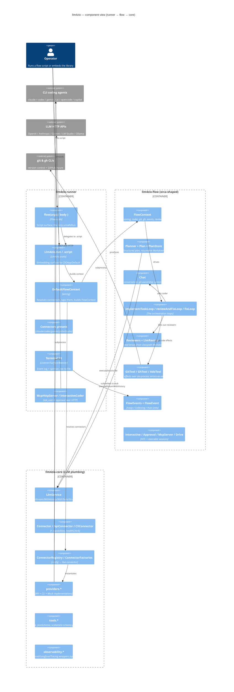

# llm4zio — Architecture Guide for New Contributors

## 1. What this repository is

**llm4zio** is a **ZIO-native Scala 3 library for talking to LLMs and orchestrating agentic software-development flows.** You write an ordinary `ZIO[R, E, A]` program that plans work, hands code-editing to an AI agent, has *other* agents review the resulting diff, then commits / pushes / opens a PR — all expressed in code rather than coaxed out of a chatbot.

It is explicitly the **ZIO counterpart to VirtusLab's [orca](https://github.com/VirtusLab/orca)** (Ox/direct-style): the same values — thin, readable, errors-as-data, no ceremony — re-expressed in the ZIO effect system. The philosophy, from `README.md` and `CLAUDE.md`: *if you want AI-generated code to always be reviewed by another agent, don't coerce the agents — express that requirement in code; don't spend tokens on formatting/committing/opening PRs, an ordinary ZIO program does that.*

> **History.** Per `CLAUDE.md`, llm4zio was once a ~39-module "agentic software house" product, forked down in 2026 to this focused 3-module library. The full product lives on the `archive/product-2026-06` branch; the current tree is the library only.

Two ways to consume it:
- **As an embedded library** — `Llm4zio.run` inside a `ZIOAppDefault` (`modules/llm4zio-runner/src/main/scala/llm4zio/runner/Llm4zio.scala:43`).
- **As single-file flow scripts** — `examples/*.sc`, each run with one `scala-cli run` command.

---

## 2. The 30-second mental model

A flow is an ordinary ZIO program handed a **`FlowContext`** (`modules/llm4zio-flow/src/main/scala/llm4zio/flow/FlowContext.scala:14`). It asks the **reasoning** connector to produce a structured `Plan` (persisted as resumable Markdown), checks out a branch via `GitTool`, then loops over tasks: the **coder** CLI agent edits the working tree through a `Chat`, the **reviewers** judge the resulting `git.diff` and feed findings back to the coder until clean, and the runtime commits/pushes/opens the PR. Every step emits `FlowEvent`s the runner renders to the terminal. Providers are uniform behind one trait `LlmService`; recoverable situations are typed *values*, genuine failures are typed *errors*; nothing touches a database — the agent CLIs and `git`/`gh` manage their own auth.

The two roles to keep straight (the "role split"):

| Role | Field in `FlowContext` | Typically | Does |
|---|---|---|---|
| **reasoning** | `reasoning: LlmService` | an **API** connector (or a CLI one) | planning, review judgements, structured output |
| **coder** | `coder: LlmService` | a **CLI** coding agent (claude/codex/gemini) | edits the working tree via its own tool loop |

---

## 3. Module layout & dependency direction

Three published modules under `modules/`, aggregated by a non-published root (`build.sbt`):

```
llm4zio-runner  →  llm4zio-flow  →  llm4zio-core
```

Arrows never reverse. All three publish to Maven Central under `io.github.riccardomerolla`; the root is `publish / skip := true`. Source layout per module is `src/main/scala`, `src/test/scala`, and (flow + runner) `src/it/scala` for integration tests.



---

## 4. `llm4zio-core` — the provider-agnostic LLM layer

*Packages: `llm4zio.core`, `llm4zio.providers`, `llm4zio.tools`, `llm4zio.observability`.*

### One trait to depend on: `LlmService`
Everything talks through `LlmService` (`modules/llm4zio-core/src/main/scala/llm4zio/core/LlmService.scala:17`). Its surface:

- `executeStream(prompt)` / `executeStreamWithHistory(messages)` → `Stream[LlmError, LlmChunk]` (streaming)
- `executeWithTools(prompt, tools)` → `IO[LlmError, ToolCallResponse]` (tool calling)
- `executeStructured[A: JsonCodec](prompt, schema)` → `IO[LlmError, A]` (typed output), plus `executeStructuredWithUsage` → `IO[LlmError, (A, Option[TokenUsage], Option[String])]` — the value plus **optional** token usage and **optional** model name, for cost tracking (`LlmService.scala:34-38`; the default delegates with `None`s)
- `isAvailable` → `UIO[Boolean]` (health check)

Callers depend on this capability, never on a concrete backend. `LlmService.fromConfig` (`LlmService.scala:61`) is a `ZLayer` that builds the right provider from an `LlmConfig` by matching on `LlmProvider`.

### `Connector` and the API/CLI split
`Connector extends LlmService` (`modules/llm4zio-core/src/main/scala/llm4zio/core/Connector.scala:13`), adding `id`, `kind`, `healthCheck`, and `capabilities`. Two sub-traits:

- **`ApiConnector`** — `kind = Api` (`Connector.scala:25`).
- **`CliConnector`** — `kind = Cli` (`Connector.scala:34`). It only requires two primitives, `complete` and `completeStream`, plus argv builders; the richer `LlmService` methods are **derived by default**. Notably `executeStructured` is implemented for *every* CLI provider by injecting a schema hint into `complete` and parsing the text back (`Connector.scala:62-64`, via `StructuredOutputs`). `executeWithTools` defaults to failing with `InvalidRequestError` unless a connector overrides it (`Connector.scala:57`).

### Capabilities are not uniform — declared per connector
`ConnectorCapabilities` (`Connector.scala:103`) records what a connector can actually do (`streaming`, `resumableSessions`, `interactiveSessions`, `askUser`, `approval`, `structuredOutput`, `usageReporting`). A flow can refuse an unsupported workflow up front. Example asymmetry encoded in the comments: claude exposes interactive/ask-user/approval; **gemini declares `InteractiveStdin` yet keeps `askUser = false`** because it can't expose an ask-user tool headless (`Connector.scala:38-44`).

### Models, config, registry
- **`Models.scala`** — `LlmProvider` enum, `ConnectorId`, `Message`/`MessageRole`, `TokenUsage`, `LlmChunk`, `LlmConfig`.
- **`ConnectorConfig.scala`** — user-facing config ADT with three cases: `ApiConnectorConfig`, `CliConnectorConfig` (carries `flags`, `sandbox`, `workingDir`, `readOnly`, `turnLimit`, `envVars`), and `FallbackChain(connectors: List[ConnectorConfig])` (a chain tried in order).
- **`ConnectorRegistry` + `ConnectorRegistryLive`** resolve a config to a live connector; **`ConnectorFactories.createRegistry(http, cli)`** (`modules/llm4zio-core/src/main/scala/llm4zio/providers/ConnectorFactories.scala:9`) wires the concrete provider map and exposes a `live` ZLayer.

### Providers (`llm4zio.providers`, ~30 files)
- **API-shaped:** `OpenAIProvider`, `AnthropicProvider`, `GeminiApiProvider`, `LmStudioProvider`, `OllamaProvider`, `OpenCodeProvider` — streaming, structured output, usage reporting.
- **CLI-shaped:** `ClaudeCliConnector`, `CodexConnector`, `GeminiCliProvider`, `PiConnector`, `OpenCodeCliConnector`, `CopilotConnector`.
- **Test:** `MockProvider` — deterministic.
- **Shared infra:** `HttpClient.scala` (incl. a reliable client with idle-timeout disabled for slow local models), `CliProcessExecutor` / `LiveCliProcessExecutor`, `CliStreamJson` (parses claude/codex/gemini stream-JSON; fixtures under `src/test/resources/*-stream.jsonl`), `RateLimiter`, `RetryPolicy`, `UsageLimits`, and per-provider model catalogues (`AnthropicModels`, `OpenAIModels`, `GeminiModels`, `LmStudioModels`).

### Tools (`llm4zio.tools`)
`Tool.scala`, `ToolRegistry`, `BuiltInTools`, `SchemaDerivation`. The notable piece: `ToolSchemaGenerator.fromMethodSignature` uses **scalameta** to turn a Scala method signature string into a JSON Schema (Scala types → JSON types; `Option`/defaults → not-required).

### Observability (`llm4zio.observability`) — present but opt-in
`MeteredLlmService` (`observability/MeteredLlmService.scala:18`) wraps any `LlmService` to record counts/tokens/latency; `Langfuse`, `Tracing`, `LlmLogger`, `Metrics`, `Logging` are similar decorators. **These are not wired by the runner by default** — the runner uses flow-layer `EventTappingService`/`CostTracker` instead (see §6).

---

## 5. `llm4zio-flow` — the orca-shaped agentic layer

*Package: `llm4zio.flow`.* This is where the "flow" concepts live.

### `FlowContext` — everything a flow needs
`FlowContext` (`modules/llm4zio-flow/src/main/scala/llm4zio/flow/FlowContext.scala:14`) bundles `reasoning`, `coder` (both `LlmService`), `git: GitTool`, `gh: GhTool`, `events: FlowEvents`, optional `reviewers`, `coderCapabilities`, `userPrompt`, and `workDir`. It exposes `given FlowEvents = events` so `stage`/`fail` resolve their sink implicitly. Flow scripts receive it as a context function (`FlowContext ?=>`), which is how bare names (`git`, `coder`, …) resolve.

### Plan / Task / PlanStore — resumable plain files
A `Plan(epicId, tasks, brief?)` (`Plan.scala:17`) persists as **plain Markdown** at `.llm4zio/plan-<hash>.md` — a deterministic path from the prompt (`Plan.defaultPath`, `Plan.scala:53`), so re-running the same prompt resumes the same plan. `PlanStore.parse`/`render` round-trip the file; `recoverOrCreate` resumes a crashed run. **No datastore.**

### Planner
`Planner.scala` produces structured types via `executeStructured`: `from`, `interactive`, `assessThenPlan` (→ `Verdict[Plan]`), `triage` (→ `Triage`), `reviewed` (self-critique), `briefed` (attach a codebase brief).

### Chat — stateful conversation with enforced git ownership
`Chat` (`Chat.scala`) is a conversation modelled as an accumulating `List[Message]` threaded through `executeStreamWithHistory` — there is no backend session token; continuity is replayed history. Crucially, **`Chat.start` prepends `CoderSystem.gitOwnership`** (`Chat.scala:34-37`) so the coder edits the working tree but does *not* commit/branch/push — keeping diff-based review meaningful. Opt out with `manageGit = true`.

### The three loops (top-level functions)
- **`implementTaskLoop`** (`ImplementLoop.scala:13`) — runs each incomplete task inside a `stage`, persisting the plan after each (so a crash resumes). A live variant `implementTaskLoopLive` exists for steerable sessions (`Drive.scala:76`).
- **`reviewAndFixLoop`** (`LlmReview.scala:151`) — the centrepiece. Each round: an optional `lint` gate runs first (if it fails, that's the result and LLM reviewers are skipped — fix the build first); otherwise a `ReviewerSelector` picks reviewers, their structured reviews fan out over the diff (`ZIO.foreachPar`, throttled by `parallelism` for rate-limited backends), findings merge, the coder fixes, and it re-reviews up to `maxRounds`. `format` runs before each round (`LlmReview.scala:186-196`).
- **`fixLoop`** (`ReviewLoop.scala:11`) — the generic evaluate→fix→re-evaluate primitive that `reviewAndFixLoop` is shaped after.

### Review system
`Review.scala` (`Severity`, `ReviewIssue`, `ReviewResult`), `Reviewer.scala` (a named lens = system prompt + optional changed-file regex scope, **loaded from classpath Markdown** under `src/main/resources/llm4zio/review/reviewers/*.md`), and `LlmReview.scala` (`Reviewers.all`/`.minimal` plus opt-in lenses `tddDiscipline`/`domainLanguage`/`effectShape`; selectors `ReviewerSelector.allEveryRound`/`whileDirty`/`llmDriven`). Shipped lenses: code-functionality, test, readability, code-structure, performance, security, scala-zio, plus the three opt-ins.

### Side-effect tools over zio-process (`Proc.scala`)
- **`GitTool`** (`GitTool.scala:12`), bound to `workDir`. **Recoverable outcomes are values, not failures:** `createBranch → CreateBranch.AlreadyExists` (`GitTool.scala:97`), `commitAll → Commit.NothingToCommit` (`GitTool.scala:105`); these are an enum returned in the value channel (`GitTool.scala:122-125`). Every git call carries a non-interactive env so a TTY-less flow can't hang on a credential prompt; GitHub pushes get a last-resort `GH_TOKEN` credential helper.
- **`GhTool`** (`GhTool.scala`) — PR create/update, issue read/comment, CI polling over the `gh` CLI. `readIssue` retries transient blips; `waitForBuild` polls `gh pr checks` to a terminal `BuildOutcome`; `updatePr` uses a REST PATCH (to dodge GitHub Projects-classic sunset).
- **`AdoTool`** (`AdoTool.scala`) — a REST client for Azure Boards work items + Azure Repos PRs (pure request-builders + parsers, thin effectful methods over `HttpClient`), driving a board-state-gated SDD flow.

### Events
`FlowEvent` is an enum of progress events — `StageStarted/Completed/Failed`, `Aborted`, `Info`, `ToolUse`, `AssistantMessage`, `TokensUsed` (`FlowEvents.scala:9-17`). `FlowEvents` is the sink trait with three implementations: `noop`, `Collecting` (for tests, accumulates into a `Ref`), and `Hub` (a bounded broadcast with back-pressure). `stage(name)(effect)` and `fail(message)` (`Stage.scala`) publish events around an effect.

### Errors — the recoverable-vs-catastrophic split
`FlowError` ADT (`FlowError.scala`): `Persistence`, `PlanParse`, `Aborted`, `Process`, `Llm(message, cause: Option[LlmError])`. The discipline (orca-flavoured): **expected, handleable outcomes go in the value channel** as typed results (`Commit.NothingToCommit`); **genuine failures fail the effect**.

### Interactivity, safety & resilience
- `Interactive.scala` (`Interaction` abstraction), `Approval.scala` (`ApprovalPolicy`/`ApprovalDecision`), `McpServer.scala` (a transport-free MCP JSON-RPC handler exposing `ask_user` and `approve` tools to a CLI agent), `Drive.scala` (drives a held `AgentSession` turn, relaying events + bridging questions).
- `TransientRetry`, `UsageLimitAware`/`UsageLimitPolicy`/`UsageLimitRetry`, `CostTracker`/`PriceList` (token cost accounting), `EventTappingService` (taps an `LlmService` to emit `FlowEvent`s).

---

## 6. `llm4zio-runner` — entry points, wiring, terminal UI

*Package: `llm4zio.runner`.*

### Two entry surfaces
- **`flow(args){ body }`** (`runner/Flow.scala:29`) — the **script surface** and the library's *only* `unsafeRun`. It resolves args/prompt, installs the Ctrl-C shutdown hook (interrupt the fiber → stages unwind → ✖ banner → JVM exits 130), and maps results to exit codes (2 = usage, 1 = failure). It simply forks `Llm4zio.script(...)`.
- **`Llm4zio.run` / `Llm4zio.script`** (`runner/Llm4zio.scala:43`) — the **embedding surface** for `ZIOAppDefault` apps: builds the `FlowContext`, streams progress to the terminal, provides http/process layers, wraps the body in usage-limit retry, and renders a final ✖ banner on failure. `script` is the pure-ZIO core (testable up to the single unsafe run).

### Wiring: `DefaultFlowContext`
`DefaultFlowContext.build` (`runner/DefaultFlowContext.scala:55`) resolves connectors from the registry, roots the CLI coder in `workDir`, and **taps each connector** through `TransientRetry → EventTappingService → (optional) UsageLimitAware` (`DefaultFlowContext.scala:28-36`). `enrichApi` fills an API config's base URL + env API key (`ANTHROPIC_API_KEY` / `OPENAI_API_KEY` / `GEMINI_API_KEY`, `DefaultFlowContext.scala:83-92`). `make` bundles built connectors with `GitTool`/`GhTool` on `workDir` and a fresh event `Hub`.

### Presets and config
`Connectors.scala` ships ready-made presets so scripts reference `claude`/`codex`/`gemini`/`pi`/`lmStudio` bare; `coderFromEnv()` reads `LLM4ZIO_CODER`. Each preset carries its edit-enabling flag (e.g. claude `permission-mode=acceptEdits`).

### Terminal rendering & MCP-over-HTTP
`TerminalListener`, `TerminalSurface`/`TerminalSafe`, `Palette`, `Banner`, `RunnerLog` — a top-down event log plus a pinned status line with a spinner, teed to a per-run log file; colour auto-disables off-TTY / under `NO_COLOR`. `McpHttpServer` binds `flow.McpServer` over zio-http and registers it with a claude agent; `InteractiveCoder` + `TerminalInteraction` route `ask_user`/approval back to the operator (powers `examples/implement-live.sc`). `ExampleFlow.scala` is the embedded `ZIOAppDefault` variant with an end-to-end integration test; `Ado.scala` builds an `AdoTool` from ADO pipeline env vars.

---

## 7. A flow, top to bottom

The canonical shape (`examples/implement.sc`), all bare names resolving from the `FlowContext ?=>` context function:

```scala
flow(args, defaultPrompt = Some("Add a multiply function to the calculator crate")):
  val planPath = Plan.defaultPath(userPrompt)
  for
    plan      <- PlanStore.recoverOrCreate(planPath)(Planner.from(reasoning, userPrompt))
    _         <- stage("branch")(git.checkoutOrCreate(plan.epicId))
    coderChat <- Chat.start(coder, system = Some("You implement one task at a time in the current repo."))
    _         <- implementTaskLoop(planPath, plan) { task =>
                   coderChat.ask(task.description) *>
                     reviewAndFixLoop(Reviewers.minimal, reasoning, coderChat, task.title, git.diff) *>
                     git.commitAll(s"${plan.epicId}: ${task.title}").unit
                 }
  yield ()
```

### Effect shape of key operations
| Operation | Shape | Notes |
|---|---|---|
| `Plan.defaultPath`, `PlanStore.parse`/`render`, `Reviewers.merge`, `AdoTool` request-builders | **pure** | deterministic, no effect |
| `Planner.*`, `Chat.ask`, `LlmService.execute*`, reviewer calls | **bounded change** (network/LLM) | typed `IO[LlmError, …]`/`IO[FlowError, …]`; no preview |
| `GitTool.createBranch` / `commitAll`, `GhTool.createPr` | **bounded change, errors-as-values** | recoverable outcomes (`AlreadyExists`, `NothingToCommit`) returned in the *value* channel, not failures |
| `assessThenPlan → Verdict[Plan]`, `triage → Triage` | **preview-returns-a-plan** | the LLM returns a structured judgement/plan you inspect before acting |
| `reviewAndFixLoop` / `fixLoop` | **bounded change, iterative** | converge-or-give-up after `maxRounds`; returns the final (possibly still-dirty) `ReviewResult` |

---

## 8. External dependencies

| Concern | Choice |
|---|---|
| Language / build | Scala 3.8.3, sbt 2.0.0 (`project/build.properties`), JVM 21 |
| Effect system | ZIO 2.1.25 (`zio`, `zio-streams`) |
| Subprocesses | zio-process 0.8.0 (via `flow.Proc`; never raw `ProcessBuilder`) |
| JSON | zio-json 0.9.0 (`derives JsonCodec` everywhere) |
| HTTP | zio-http 3.10.1 (API providers + MCP server) |
| Logging | zio-logging 2.4.0 |
| Schema parsing | scalameta 4.13.6 (tool-schema generation) |
| Terminal colour | fansi 0.5.0 (runner only) |
| Testing | zio-test (+ `-sbt`, `-magnolia`) |
| Lint/format | scalafix, scalafmt, sbt-tpolecat; publishing via sbt-ci-release + sbt-dynver |
| External processes at runtime | the agent CLIs (claude/codex/gemini/…), `git`, `gh` — each manages its own auth |

The compiler is strict: `-Wunused:all`, `-Werror`, `-explain` (`build.sbt`). **Gotcha:** a wildcard `import zio.*` pulls in `zio.Task`, which shadows the library's flow `Task` type — import specific names in files that name `Task`.

---

## 9. Build, test, run (for contributors)

```bash
sbt compile                          # all modules
sbt test                             # unit tests — INCREMENTAL/cached under sbt 2
sbt testFull                         # force the full unit run (what CI does)
sbt "llm4zioFlow/It/testFull"        # integration tests: spawn real git, no network
sbt fmt                              # scalafix + scalafmt (apply)
sbt check                            # scalafix --check + scalafmtCheck (verify)
sbt 'llm4zioFlow/testOnly llm4zio.flow.PlanSpec'   # single spec

scala-cli run examples/implement.sc -- "your task here"   # run a flow script
examples/seed.sh implement --local --run                  # run against your in-tree build
```

- **TDD-first.** zio-test throughout; the `Mock` provider gives deterministic LLM behaviour. There's roughly one spec per source file under each module's `src/test/scala`.
- **Integration tests** (`src/it/scala`, config `lazy val It = config("it") extend Test` in `build.sbt`) spawn real `git` against a temp repo + a local *bare* remote — **no network**. Examples: `flow/GitToolSpec` (It), `runner/ExampleFlowSpec` (It, end-to-end), `runner/McpHttpServerItSpec`.
- **CI** (`.github/workflows/ci.yml`) is one sbt invocation — `; check ; testFull ; llm4zioFlow/It/testFull ; llm4zioRunner/It/testFull` — on JDK 21. A `v*` tag triggers the `publish` job (`sbt ci-release` to Maven Central + a GitHub Release). `CHANGELOG.md` tracks releases.

---

## 10. Conventions to internalize (from `CLAUDE.md`)

- **ZIO-native throughout** — no `Future`, no blocking-by-default; wrap blocking work in `ZIO.attemptBlocking`; subprocesses go through `flow.Proc`.
- **Typed errors, no `Throwable` in signatures** — core uses `LlmError`, flow uses `FlowError`.
- **Recoverable vs catastrophic** — expected outcomes are typed *values* (`Commit.NothingToCommit`, `CreateBranch.AlreadyExists`); genuine failures fail the effect.
- **No `var`** — use `Ref`/`Queue`/`Hub`.
- **Stateless + plain files** — no datastore; resumable plans are Markdown under `.llm4zio/`.
- **Role split** — reasoning over an API connector, code-editing over a CLI agent; a single all-CLI backend (e.g. all-claude) can do both.
- **The runtime owns git** — coder chats are seeded not to commit/push/branch (`CoderSystem.gitOwnership`); the flow does that via `ctx.git.*`.
- **TDD** — every behaviour is driven by a test first; use `Mock` for determinism.

---

## 11. Where to start reading

| You want to… | Start here |
|---|---|
| See the canonical flow shape | `examples/implement.sc` + `README.md` |
| Understand the script runtime | `runner/Flow.scala` → `runner/Llm4zio.scala` (`script` → `run`) |
| Understand the context object | `flow/FlowContext.scala` |
| Understand the review loop | `flow/LlmReview.scala:151` (`reviewAndFixLoop`) |
| Understand provider abstraction | `core/LlmService.scala` → `core/Connector.scala` → `providers/ConnectorFactories.scala` |
| Embed in a ZIO app | `runner/ExampleFlow.scala` + `Llm4zio.run` |
| See HITL / steerable sessions | `flow/McpServer.scala` + `runner/McpHttpServer.scala` + `examples/implement-live.sc` |

The `examples/` directory holds ~15 self-documenting scripts (autonomous, interactive, enhanced, live, epic, issue→PR, spec-driven, fully-local via LM Studio, Azure DevOps) and `examples/starters/` seed projects — the fastest way to see the library exercised end-to-end.