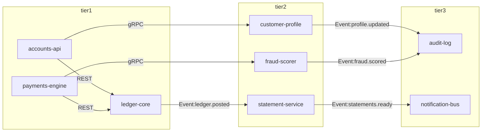

# bankmod — Services Graph

> Auto-generated by `DocsGenerator`. Do not edit by hand.

The canonical 8-service fixture used for bankmod's validator, renderers, and demo scenarios.

## Full graph

## Services by tier

### Tier1

| service | owner | inbound ports | outbound edges |
|---|---|---|---|
| [`accounts-api`](./services/accounts-api.md) | Product | 1 | 2 |
| [`ledger-core`](./services/ledger-core.md) | Platform | 1 | 1 |
| [`payments-engine`](./services/payments-engine.md) | Platform | 1 | 2 |

### Tier2

| service | owner | inbound ports | outbound edges |
|---|---|---|---|
| [`customer-profile`](./services/customer-profile.md) | Product | 1 | 1 |
| [`fraud-scorer`](./services/fraud-scorer.md) | Platform | 1 | 1 |
| [`statement-service`](./services/statement-service.md) | Product | 1 | 1 |

### Tier3

| service | owner | inbound ports | outbound edges |
|---|---|---|---|
| [`audit-log`](./services/audit-log.md) | Shared | 1 | 0 |
| [`notification-bus`](./services/notification-bus.md) | Shared | 1 | 0 |

## Further reading

- [Invariant catalog](./invariants.md)
- [JSON Schema for `Graph`](./graph-schema.json)
- Per-service pages under [`./services/`](./services/)
- Demo script: [../demo-script.md](../demo-script.md)
