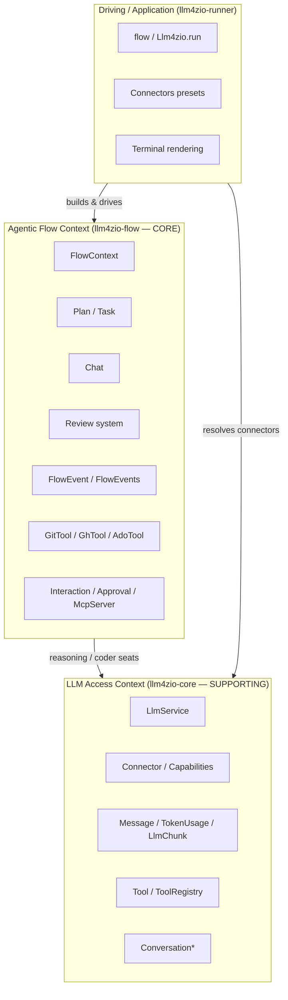
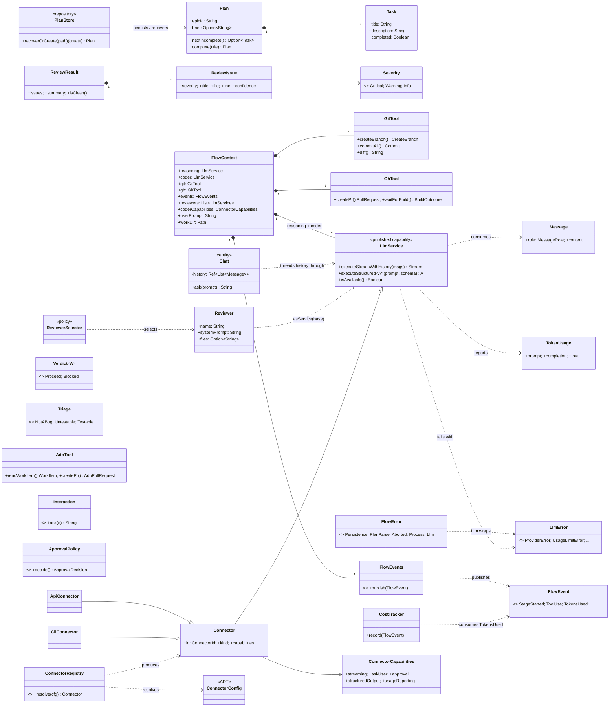

## 1. The core domain

llm4zio's core domain is **agentic software-development flows**: expressing, as an ordinary typed effect program, the act of *planning a change, delegating the code-editing to an AI agent, having other agents review the resulting diff, and committing/pushing/raising a PR* — with **provider-agnostic LLM access** as the supporting subdomain underneath.

The strategic split is visible directly in the module graph (`build.sbt`, dependency direction `runner → flow → core`):

- **Core domain — Agentic Flow** (`llm4zio-flow`): plans, tasks, the coder conversation, the review-and-fix loop, the git/PR side-effect tools, flow events and errors. This is the differentiating model and where the ubiquitous language is richest.
- **Generic supporting subdomain — LLM Access** (`llm4zio-core`): a uniform `LlmService` over many providers, connectors, capabilities, tools, structured output. Replaceable in principle, but the thing every flow stands on.
- **Driving/Application layer** (`llm4zio-runner`): entry points, connector presets, context wiring, terminal rendering. It *uses* the domain; it adds little domain vocabulary of its own (mostly presentation and configuration).

The pervasive modelling discipline (from `CLAUDE.md` and visible everywhere): **recoverable situations are typed values, genuine failures are typed errors.** `GitTool.commitAll` returns `Commit.NothingToCommit` in the value channel (`modules/llm4zio-flow/.../GitTool.scala:124`), it does not fail; only catastrophic problems become `FlowError.Process`.

---

## 2. Bounded contexts



The two contexts share a **conformist** relationship: the Flow context depends on the LLM context's published language (`LlmService`, `Message`, `TokenUsage`, `ConnectorCapabilities`, `LlmError`) and conforms to it — it does not wrap it in an anti-corruption layer. Note `FlowError.Llm` carries a required `message: String` plus an `Option[LlmError]` (`FlowError.scala`), the one place the two error vocabularies meet.

A nuance worth flagging: `Conversation.scala` (in core) defines a rich `ConversationThread`/`Checkpoint`/`PromptTemplate`/`PromptRegistry`/`ConversationStore` vocabulary, but the *flow* layer does **not** use it — `Chat` (flow) models conversation independently as a `Ref[List[Message]]`. So core carries two conversation vocabularies, only the primitive `Message` of which is actually consumed by the core domain. This is a remnant model, not a wired part of the flow.

---

## 3. Ubiquitous language

| Term | Meaning in code | Where |
|---|---|---|
| **Flow** | An ordinary `ZIO[Any, FlowError, Any]` program, run with a `FlowContext` in scope, that plans → implements → reviews → ships. | `runner/Flow.scala:29` |
| **FlowContext** | The bag of everything a flow needs; summoned by bare names in scripts. | `flow/FlowContext.scala:14` |
| **Reasoning / Coder (the role split)** | Two `LlmService` "seats": reasoning (planning, review — usually an API connector), coder (edits the tree — usually a CLI agent). | `FlowContext.scala:15-16` |
| **Plan / Epic / Task** | A unit of work: an `epicId` + ordered `Task`s; persisted as resumable Markdown. | `flow/Plan.scala:10,17` |
| **Brief** | An optional codebase summary attached to a Plan to ground the coder. | `Plan.scala:19`, `Planner.briefed` |
| **Chat** | A stateful coder conversation (accumulating history); seeded *not* to touch git. | `flow/Chat.scala`, `CoderSystem.gitOwnership` |
| **git ownership** | The rule that the runtime, not the coder, commits/branches/pushes. | `flow/CoderSystem.scala:8` |
| **Reviewer / lens** | A named review perspective = system prompt + optional file scope, loaded from classpath Markdown. | `flow/Reviewer.scala:15`, `resources/llm4zio/review/reviewers/*.md` |
| **Review-and-fix loop** | Reviewers judge the diff → coder fixes → re-review, up to `maxRounds`. | `flow/LlmReview.scala:151` |
| **Stage** | A named, observable step that brackets an effect with start/complete/fail events. | `flow/Stage.scala:8` |
| **FlowEvent** | A progress fact (StageStarted, ToolUse, TokensUsed, …) published to a sink. | `flow/FlowEvents.scala:9` |
| **Verdict / Triage** | Structured LLM judgements you inspect before acting (`Proceed`/`Blocked`; `NotABug`/`Untestable`/`Testable`). | `flow/Verdict.scala:6`, `flow/Triage.scala:20` |
| **Connector** | An `LlmService` with identity, kind, health, capabilities. | `core/Connector.scala:13` |
| **Capability** | A declared, per-connector ability (streaming, askUser, approval, …) — *not uniform*. | `core/Connector.scala:103` |
| **Recoverable outcome** | An expected result returned as a value, not a failure (`AlreadyExists`, `NothingToCommit`). | `GitTool.scala:121-125` |
| **Interaction / Approval** | The HITL primitives: ask a human a question / allow-or-deny a tool call. | `flow/Interactive.scala:9`, `flow/Approval.scala:7` |

---

## 4. Central entities, aggregates & value objects

### 4.1 Agentic Flow context (the core)

**`FlowContext`** (`flow/FlowContext.scala:14`) is the **aggregate root of a running flow** — it composes the two LLM seats, the side-effect tools, the event sink, optional reviewers, declared coder capabilities, the prompt and the working directory:

```scala
final case class FlowContext(
  reasoning: LlmService, coder: LlmService,
  git: GitTool, gh: GhTool, events: FlowEvents,
  reviewers: List[LlmService] = Nil,
  coderCapabilities: ConnectorCapabilities = ConnectorCapabilities(),
  userPrompt: String = "", workDir: Path = …)
```

**`Plan`** (`flow/Plan.scala:17`) is the **work aggregate**: `epicId`, `List[Task]`, optional `brief`. `Task` (`Plan.scala:10`) is an entity-within-aggregate (`title`, `description`, `completed`). The Plan owns task-completion transitions (`complete`, `nextIncomplete`) and rendering. **`PlanStore`** (`flow/PlanStore.scala`) is its **repository** — a plain-file persistence (`.llm4zio/plan-<hash>.md`) keyed by a deterministic path from the prompt (`Plan.defaultPath`, `Plan.scala:53`), enabling crash-resume via `recoverOrCreate`.

**`Chat`** (`flow/Chat.scala`) is an entity holding mutable conversation state (`Ref[List[Message]]`) — the coder's working memory across tasks. Its invariant — *the coder never owns git* — is enforced at construction (`Chat.start` prepends `CoderSystem.gitOwnership`).

**Review subdomain** — value objects all derive `JsonCodec` so the LLM can return them structurally:
- `Severity` (`Critical|Warning|Info`), `ReviewIssue`, `ReviewResult` (`flow/Review.scala:6-24`).
- `Reviewer` (a named lens; `flow/Reviewer.scala:15`) and `ReviewerSelector` (a domain *policy* — `allEveryRound`/`whileDirty`/`llmDriven`).

**Planner outputs** — `Verdict[A]` (`Proceed`/`Blocked`, `flow/Verdict.scala:6`), `Triage` (`NotABug`/`Untestable`/`Testable`, `flow/Triage.scala:20`), `PlanningStep` (`AskUser`/`Proposed`, `flow/Interactive.scala:20`). These encode the "preview-returns-a-plan" pattern: a structured judgement to inspect before acting.

**Side-effect tools** (services over `zio-process`, bound to `workDir`):
- `GitTool` with recoverable-outcome enums `CreateBranch{Created,AlreadyExists}` and `Commit{Committed,NothingToCommit}` (`GitTool.scala:121-125`).
- `GhTool` with value objects `Issue`, `PullRequest`, `IssueRef`, and the CI state `BuildOutcome{Success,Failure,Pending,TimedOut}` (`flow/GhTool.scala`).
- `AdoTool` with `WorkItem`, `AdoPullRequest`, `AdoConfig`, `AdoRequest` for the Azure Boards/Repos board-gated flow (`flow/AdoTool.scala`).

**Observability & control** — `FlowEvent` (enum, `FlowEvents.scala:9`) with sinks `noop`/`Collecting`/`Hub`; `CostTracker`+`PriceList` accumulate `TokenUsage` per agent/model from `TokensUsed` events. **HITL**: `Interaction`, `ApprovalPolicy`/`ApprovalDecision`, `McpTool`/`McpServer` (a transport-free MCP handler exposing `ask_user`/`approve`), `Drive` over an `AgentSession`.

**Error model** — `FlowError` ADT: `Persistence`, `PlanParse`, `Aborted`, `Process`, `Llm` (`flow/FlowError.scala`).

### 4.2 LLM Access context (supporting)

**`LlmService`** (`core/LlmService.scala:17`) is the **published capability** the whole system depends on: `executeStream`, `executeStreamWithHistory`, `executeWithTools`, `executeStructured`/`WithUsage`, `isAvailable`. **`Connector`** (`core/Connector.scala:13`) refines it with identity and metadata; `ApiConnector`/`CliConnector` are the two kinds. The decisive domain rule: **capabilities are declared, not uniform** — `ConnectorCapabilities` (`Connector.scala:103`) records what each backend can actually do (e.g. gemini's `askUser = false` headless), and `CliConnector` *derives* the richer methods (structured output via a schema hint, tool-calling failing unless overridden).

Value objects: `LlmProvider`, `ConnectorId`, `Message`/`MessageRole`, `TokenUsage`, `LlmChunk`, `LlmConfig` (`core/Models.scala`); config ADT `ConnectorConfig` → `ApiConnectorConfig`/`CliConnectorConfig`/`FallbackChain` (`core/ConnectorConfig.scala`); error ADT `LlmError` (`core/Errors.scala`). **`ConnectorRegistry`** (`core/ConnectorRegistry.scala`) is the factory/repository resolving a config to a live `Connector`. **Tools**: `Tool`/`AnyTool`, `JsonSchema`, `ToolCall`/`ToolCallResponse`, `ToolRegistry`.

---

## 5. Domain model — class diagram



---

## 6. How the language flows (the canonical interaction)

The model reads top-to-bottom in `examples/implement.sc`, every noun above appearing as a bare name resolved from the `FlowContext ?=>` context function:

1. `Planner.from(reasoning, userPrompt)` asks the **reasoning** seat for a structured **`Plan`**; **`PlanStore.recoverOrCreate`** resumes it from `.llm4zio/`.
2. `stage("branch")(git.checkoutOrCreate(plan.epicId))` brackets a **`GitTool`** side-effect as an observable **stage**.
3. `Chat.start(coder, …)` opens the **coder** **`Chat`** under the git-ownership invariant.
4. `implementTaskLoop` walks each incomplete **`Task`**: the coder edits the tree, `reviewAndFixLoop(Reviewers.minimal, reasoning, …, git.diff)` fans **`Reviewer`** lenses over the diff into **`ReviewResult`**s and converges, then `git.commitAll(...)` returns a **`Commit`** outcome.

Throughout, every step publishes **`FlowEvent`**s to the context's **`FlowEvents`** sink; recoverable git/PR situations come back as values; only catastrophe becomes **`FlowError`**.

---

## 7. Modelling notes (wired vs. merely present)

- **Wired and central:** `FlowContext`, `Plan`/`Task`/`PlanStore`, `Chat`, the `Reviewer`/`ReviewResult`/`reviewAndFixLoop` triad, `GitTool`/`GhTool`, `FlowEvent`/`FlowEvents`, `LlmService`/`Connector`/`ConnectorCapabilities`/`ConnectorRegistry`, `FlowError`/`LlmError`. These carry the ubiquitous language and are exercised by `examples/*.sc` and integration tests.
- **Wired but secondary:** `AdoTool` (only the ADO examples), `Interaction`/`ApprovalPolicy`/`McpServer`/`Drive` (the live/interactive examples), `CostTracker`/`PriceList` (runner cost summary), `Verdict`/`Triage` (issue/assess examples).
- **Present but not part of the live flow model:** `core/Conversation.scala`'s `ConversationThread`/`PromptTemplate`/`PromptRegistry`/`ConversationStore` — a parallel, unused conversation vocabulary; the flow uses `Chat` instead. The `core/observability.*` decorators (`MeteredLlmService`, `Langfuse`, `Tracing`) similarly exist but the runner taps connectors via the flow-layer `EventTappingService`/`CostTracker` rather than wiring these.
- **The pervasive invariant** to internalise as the model's spine: *recoverable = value, catastrophic = error*, and *the runtime owns git, the coder owns edits*. Both are enforced in the types (`CreateBranch`/`Commit` enums; `CoderSystem.gitOwnership` in `Chat.start`), not left to convention.